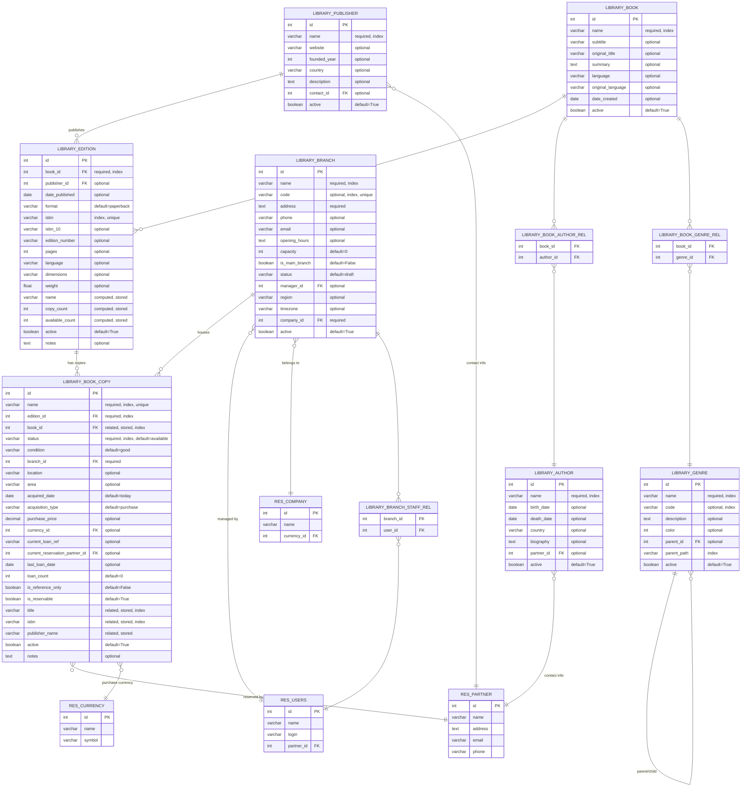

# Library Base - Entity Relationship Diagram

## Relaciones y Cardinalidades

### Relaciones Principales (1:N)

- **Book → Edition**: 1 libro puede tener múltiples ediciones (0 o más)
- **Edition → Copy**: 1 edición puede tener múltiples copias (0 o más)
- **Publisher → Edition**: 1 editorial puede publicar múltiples ediciones
- **Branch → Copy**: 1 sucursal puede tener múltiples copias
- **Genre → Genre**: autoreferencial para jerarquía (parent_id)

### Relaciones Many-to-Many

- **Book ↔ Author**: libros pueden tener múltiples autores, autores múltiples libros
- **Book ↔ Genre**: libros pueden pertenecer a múltiples géneros
- **Branch ↔ Users**: sucursales pueden tener múltiples staff members

### Relaciones Opcionales (FK nullable)

- **Author → Partner**: para información de contacto extendida
- **Publisher → Partner**: para datos de contacto
- **Branch → User**: manager opcional
- **Copy → Partner**: para reservas actuales

### Constraints Importantes

- **ISBN único**: a nivel de edición
- **Barcode único**: a nivel de copia
- **Una sola sucursal principal**: constraint en Branch
- **Fechas válidas**: birth_date < death_date en Author
